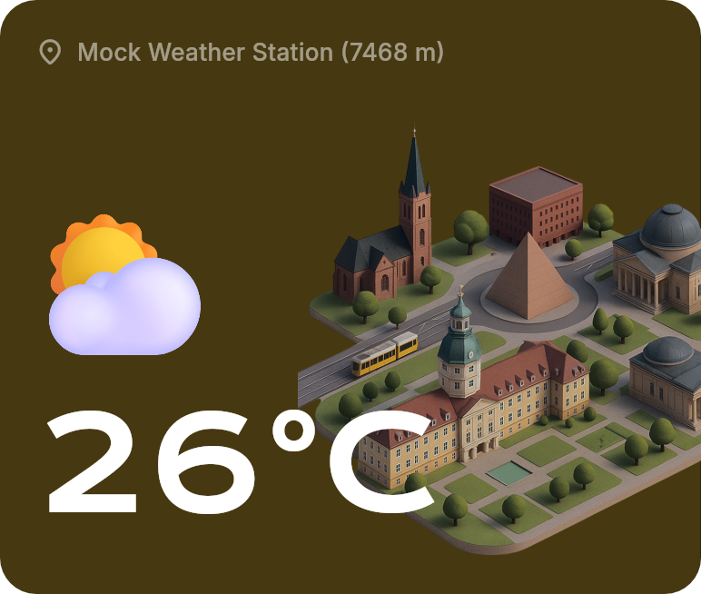
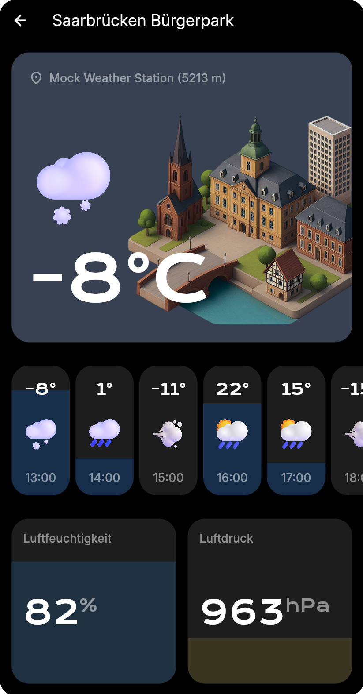
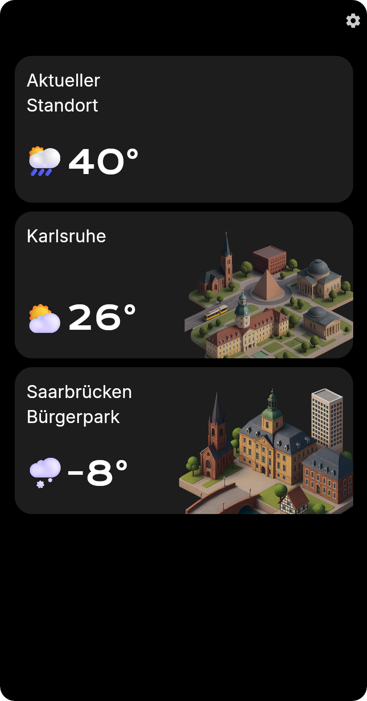

# weather

A simple weather app build with flutter using the [Bright Sky API](https://brightsky.dev).

Features:
* list of static and dynamic locations
* detail view with weather icon, temperature, humidity, pressure, precipitation predictions by hour
* settings for temperature unit
* localizations

Architecture:
Feature-First, Layer-Second

State-Management:
Riverpod

Screenshots:

